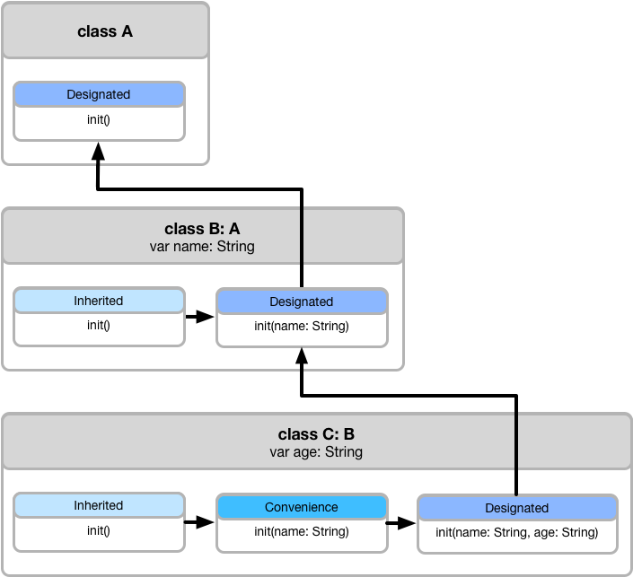

# Design Patterns

## Object Initialization

Initialization sets the instance variables of an object to reasonable and useful initial values. It can also allocate and prepare other global resources needed by the object. Every object that declares instance variables should implement an initializing method—unless the default set-everything-to-zero initialization is sufficient. If an object does not implement an initializer, Cocoa invokes the initializer of the nearest ancestor instead.

Cocoa allows declare multiple initializers, with one or more parameters, which are instance methods that begin with **init** and return an object of the dynamic type *id* in Objective-C, and an object of specific class in Swift.

Here are a few examples of initializers:

**Objective-C** 

	- (instanceType)initWithFrame:(NSRect)frameRect;
	- (instancetype)initWithTimeInterval:(NSTimeInterval)secsToBeAdded sinceDate:(NSDate *)date;

**Swift**

	init(frame: CGRect)
	init(timeInterval secsToBeAdded: TimeInterval, since date: Date)
	
### Designated and Convenience initializers

The designated initializer plays an important role for a class. It ensures that inherited instance variables are initialized by invoking the designated initializer of the superclass. It is typically the init...` method that has the most parameters and that does most of the initialization work, and it is the initializer that secondary initializers of the class invoke with messages to self.

The designated initializer pattern helps ensure that inherited initializers properly initialize all instance variables. A subclass that needs to perform nontrivial initialization should override all of its superclass’s designated initializers, but it does not need to override the convenience initializers.

In **Objective-C**, object initialization is based on the notion of a *designated initializer*, an initializer method that is responsible for calling one of its superclass’s initializers and then initializing its own instance variables. Initializers that are not designated initializers are known as *convenience initializers*. Convenience initializers typically delegate to another initializer—eventually terminating the chain at a designated initializer—rather than performing initialization themselves.

To clarify the distinction between designated and designated initializers clear, you can add the `NS_DESIGNATED_INITIALIZER` macro to any method in the init family, denoting it a designated initializer. Using this macro introduces a few restrictions:

* The implementation of a designated initializer must chain to a superclass init method (with `[super init...]`) that is a designated initializer for the superclass.
* The implementation of a convenience initializer (an initializer not marked as a designated initializer within a class that has at least one initializer marked as a designated initializer) must delegate to another initializer (with [self init...]).
* If a class provides one or more designated initializers, it must implement all of the designated initializers of its superclass.

If any of these restrictions are violated, you receive warnings from the compiler.

If you use the `NS_DESIGNATED_INITIALIZER` macro in your class, you need to mark all of your designated initializers with this macro. All other initializers will be considered to be convenience initializers.

Example:

	- (instancetype)initWithName:(NSString *)name NS_DESIGNATED_INITIALIZER;
	- (instancetype)init;


The figure below shows the overall initializer chain for all three classes:


In **Swift**, *designated initializers* are the primary initializers for a class. A designated initializer fully initializes all properties introduced by that class and calls an appropriate superclass initializer to continue the initialization process up the superclass chain.

Classes tend to have very few designated initializers, and it is quite common for a class to have only one. Designated initializers are “funnel” points through which initialization takes place, and through which the initialization process continues up the superclass chain.

Every class must have at least one designated initializer. In some cases, this requirement is satisfied by inheriting one or more designated initializers from a superclass.

*Convenience initializers* are secondary, supporting initializers for a class. You can define a convenience initializer to call a designated initializer from the same class as the convenience initializer with some of the designated initializer’s parameters set to default values. You can also define a convenience initializer to create an instance of that class for a specific use case or input value type.

You do not have to provide convenience initializers if your class does not require them. Create convenience initializers whenever a shortcut to a common initialization pattern will save time or make initialization of the class clearer in intent.

There is a private word to use when an initializer is a convenience one, and this word is `convenience`. Designated initializers do not use any reserved word to denote it.

Example:

```	
	init(name: String) {
		...
	}
	
	convenience init() {
		self.init(name: "The name")
	} 
```
In Swift, the initializer chain is like the figure below:




## Delegation

## Target-Action

## Observation (KVO, NSNotificationCenter)

## Factory (Class clusters)

## Prototype (copy, copyWithZone)

## Command (NSInvocation)

## Extensions (Objective-C categories, Swift extensions)

## Dependency injection
