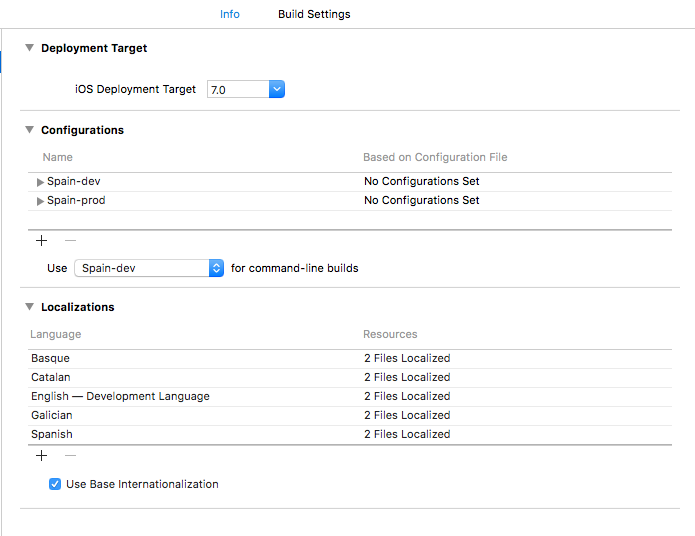
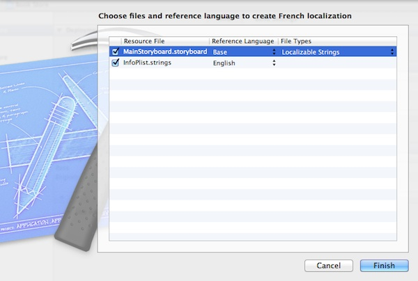
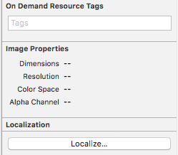
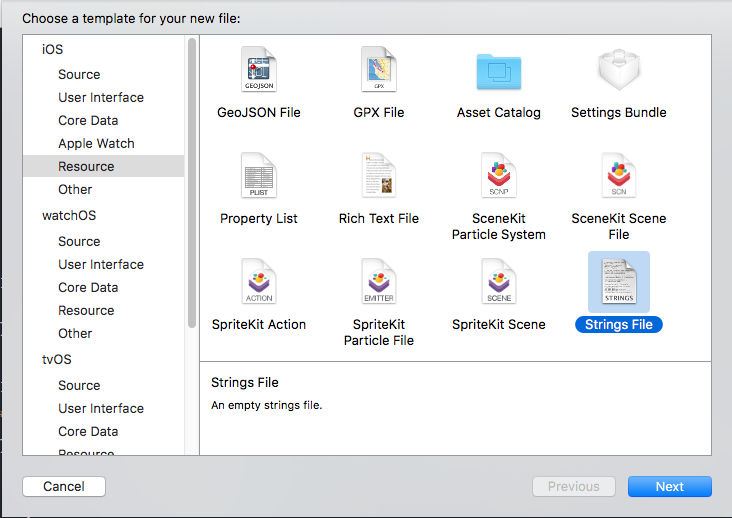
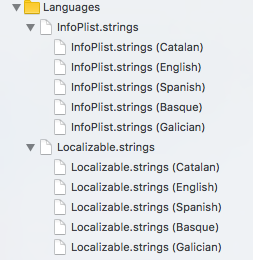

# Localization

**Enabling Base Internationalization**

Recent versions of Xcode turn on base internationalization by default but let's just make sure your project is using it. Select your project in Xcode's file navigator. (Make sure you're looking at the Project, not the target).

When you check the Base Internationalization checkbox, Xcode will ask which resources to use as well as your default language. Xcode will create a `Base.lproj` folder, and add any resource files you select. It also creates a language folder for the development language.



If you want to add more languages, you can use the menu command Editor > Add Localization. Or right from the Info panel, press the + button and choose the language you want to add. Xcode will again ask which resources you plan to localize, and create a `[language code].lproj` folder for each.



When we add a new localization, Xcode scans through the base storyboard, extracts those textual items to be localized and put them into the strings file.

**Localizing Image**

When you want localize an image, you need select the image in the project navigator and in the file inspector you need touch the button named `Localize...`. Click the button and you’ll be prompted for confirmation, then choose the language.



Next you’ll find two folders: `en.lproj` and `es.lproj` for example. Both folders are automatically generated by Xcode for localization.

**Localizing Dynamic Strings**

Strings are perhaps the most versatile data type in computing. They’re passed around as symbols, used to encode numeric values, associate values to keys, represent resource paths, store linguistic content, and format information. Having a strong handle on user-facing strings is essential to making a great user experience.

In Foundation, there is a convenient macro for denoting strings as user-facing: `NSLocalizedString`.

`NSLocalizedString` provides string localization in “compile-once / run everywhere” fashion, replacing all localized strings with their respective translation according to the string tables of the user settings. But even if you’re not going to localize your app to any other markets, `NSLocalizedString` does wonders with respect to copy writing & editing.

`NSLocalizedString` is a Foundation macro that returns a localized version of a string. It has two arguments: key, which uniquely identifies the string to be localized, and comment, a string that is used to provide sufficient context for accurate translation.

In practice, the key is often just the base translation string to be used, while comment is usually nil, unless there is an ambiguous context:


```objectivec
user.placeholder = NSLocalizedString(@"Username", nil);
```

`NSLocalizedString` can also be used as a format string in `NSString +stringWithFormat:`. In these cases, it’s important to use the comment argument to provide enough context to be properly translated.

```objectivec
self.title = [NSString stringWithFormat:NSLocalizedString(@"%@'s Profile", @"{User First Name}'s Profile"), user.name];

label.text = [NSString stringWithFormat:NSLocalizedString(@"Showing %lu of %lu cards", @"Showing {number} of {total number} cards"), [cards objectAtIndex:i], [cards count]];
```

There are four varieties of `NSLocalizedString`, with increasing levels of control:

```objectivec
NSString * NSLocalizedString(
  NSString *key,
  NSString *comment
)

NSString * NSLocalizedStringFromTable(
  NSString *key,
  NSString *tableName,
  NSString *comment
)

NSString * NSLocalizedStringFromTableInBundle(
  NSString *key,
  NSString *tableName,
  NSBundle *bundle,
  NSString *comment
)

NSString * NSLocalizedStringWithDefaultValue(
  NSString *key,
  NSString *tableName,
  NSBundle *bundle,
  NSString *value,
  NSString *comment
)

```


At runtime, NSLocalizedString determines the preferred language, and finds a corresponding Localizable.strings file in the app bundle. For example, if the user prefers French, the file `en.lproj/Localizable.strings` will be consulted.

Here’s what that looks like:

```objectivec

"TXT_USER_PLACEHOLDER"="NIF, NIE, ID Card, Passport or Username";

"TXT_BALANCE_AMOUNT"="Amount (%@)";

```


In order to improve our code and avoid using empty parameters there are different options like creating macros, creating an extension of a String or using an external library like (ex. https://github.com/AliSoftware/SwiftGen˚).

Some examples:

```objectivec
#define LSSTRING(str) NSLocalizedString(str, nil)
```

```objectivec
- (NSString *)localizedString:(NSString *)key language:(NSString*)language {    
  if (language == nil) {
       language = [[NSLocale preferredLanguages] objectAtIndex:0];
       language = [language substringToIndex:2];
   }

    NSString *path = [[NSBundle mainBundle] pathForResource:language ofType:@"lproj"];
    NSBundle *languageBundle = [NSBundle bundleWithPath:path];
    NSString *text = [languageBundle localizedStringForKey:key value:@"" table:nil];

    if (!text) {
        path = [[NSBundle mainBundle] pathForResource:@"en" ofType:@"lproj"];
        languageBundle = [NSBundle bundleWithPath:path];
        text = [languageBundle localizedStringForKey:key value:@"" table:nil];
    }

    return text;
}

[textField setText:[self localizedString:text language:@"en"]];

```

**Generating localizable files**

Localizable.strings files are initially generated with `genstrings`.

The `genstrings` utility generates a .strings file(s) from the C or Objective-C (.c or .m) source code file(s) given as the argument(s). A .strings file is used for localizing an application for different languages, as described under “Internationalization” in the Cocoa Developer Documentation.

`genstrings` goes through each of the selected source files, and for each use of `NSLocalizedString`, appends the key and comment into a target file. It’s up to the developer to then create a copy of that file for each targeted locale and have a localizer translate it.

Other way to create the `Localizable.strings` file is with the project navigator. In the project navigator, create a new file under the Supporting Files folder. Select the Strings file template and click the Next button.



Your app need looks like:




## Existing tools

**Twine**

`Twine` is an open-source command line tool written in Ruby that manages all of your strings, comments, and translations in a single text file. Twine parses this file and then generates all of the `.strings` files for you.

With `Twine`, we have complete control over the generation of these `.strings` files. We don’t have to worry about our developers or translators forgetting to escape a double quote or forgetting to put a semicolon at the end of each line. And, if we have a change we need to make to a number of strings across all of our languages, we have a single, easy place to do so.

Example:

```objectivec

[[General]]
        [yes]
            en = Yes
            es = Sí
            fr = Oui
            ja = はい
        [no]
            en = No
            fr = Non
            ja = いいえ

    [[Errors]]
        [path_not_found_error]
            en = The file '%@' could not be found.
            tags = app1,app6
            comment = An error describing when a path on the filesystem could not be found.
        [network_unavailable_error]
            en = The network is currently unavailable.
            tags = app1
            comment = An error describing when the device can not connect to the internet.
        [dismiss_error]
            ref = yes
            en = Dismiss

    [[Escaping Example]]
        [list_item_separator]
            en = `, `
            tags = mytag
            comment = A string that should be placed between multiple items in a list. For example: Red, Green, Blue
        [grave_accent_quoted_string]
            en = ``%@``
            tags = myothertag
            comment = This string will evaluate to `%@`.

```

**SwiftGen**

SwiftGen is a suite of tools written in Swift to auto-generate Swift code (or anything else actually) for various assets of your project:

+ enums for your Assets Catalogs images
+ enums for your Localizable.strings strings.
+ enums for your UIStoryboards and their Scenes
+ enums for your NSStoryboards and their Scenes
+ enums for your Colors.
+ enums for your Fonts.

In this case to use for localization, we must do the next:


This will generate a Swift enum `L10n` that will map all your ` Localizable.strings` keys to an enum case. Additionaly, if it detects placeholders like `%@`,`%d`,`%f`, it will add associated values to that case.

Once the code has been generated by the script, you can use it this way in your Swift code:

```swift
/let title = L10n.AlertTitle.string
// -> "Title of the Alert"

// Alternative syntax, shorter
let msg = tr(.AlertMessage)
// -> "Some alert body there"

// Strings with parameters
let nbApples = tr(.ApplesCount(5))
// -> "You have 5 apples"

// More parameters of various types!
let ban = tr(.BananasOwner(2, "John"))
// -> "Those 2 bananas belong to John."
```


# Internationalization

**NSLocale**

`NSLocale` is a Foundation class that encapsulates all of the conventions about language and culture for a particular locale.

Each locale corresponds to a locale identifier, such as en_US, fr_FR, ja_JP, and en_GB, which include a language code.

Users can change their locale settings in the “Language & Region".

Now let´s go to see some useful functions:

Initializes the receiver using a given locale identifier.

```objectivec
NSLog(@"%@",[[NSLocale alloc]initWithLocaleIdentifier:@"en_US"]);
```

Returns a locale initialized using the given locale identifier.

```objectivec
NSLog(@"%@",[NSLocale localeWithLocaleIdentifier:@"en_US"]);
```

Returns the root, canonical locale, that contains fixed backstop settings that provide values for otherwise undefined keys.

```objectivec
NSLog(@"%@",[NSLocale systemLocale]);
```

Returns the logical locale for the current user.

```objectivec
NSLog(@"%@",[NSLocale currentLocale]);
```

Getting Information About a Locale

```objectivec
NSLocale *locale = [NSLocale localeWithLocaleIdentifier:@"en_US"];
NSLog(@"%@",[locale displayNameForKey:NSLocaleIdentifier value:@"en_US"]);
```

**NSDateFormatter**

Instances of `NSDateFormatter` create string representations of `NSDate` objects, and convert textual representations of dates and times into `NSDate` objects. For user-visible representations of dates and times, `NSDateFormatter` provides a variety of localized presets and configuration options. For fixed format representations of dates and times, you can specify a custom format string.

When displaying a date to a user, you set the `dateStyle` and timeStyle properties of the date formatter according to your particular needs. For example, if you want to show the month, day, and year without showing the time, you would set the dateStyle property to `NSDateFormatterLongStyle` and the timeStyle property to `NSDateFormatterNoStyle`. Conversely, if you want to show only the time, you would set the dateStyle property to `NSDateFormatterNoStyle` and the timeStyle property to `NSDateFormatterShortStyle`. Based on the values of the dateStyle and timeStyle properties, `NSDateFormatter` provides a representation of a specified date that is appropriate for a given locale.

```objectivec
NSDateFormatter *dateFormatter = [[NSDateFormatter alloc] init];
dateFormatter.dateStyle = NSDateFormatterMediumStyle;
dateFormatter.timeStyle = NSDateFormatterNoStyle;

NSDate *date = [NSDate dateWithTimeIntervalSinceReferenceDate:118800];

// US English Locale (en_US)
dateFormatter.locale = [[NSLocale alloc] initWithLocaleIdentifier:@"en_US"];
NSLog(@"%@", [dateFormatter stringFromDate:date]); // Jan 2, 2001

// French Locale (fr_FR)
dateFormatter.locale = [[NSLocale alloc] initWithLocaleIdentifier:@"fr_FR"];
NSLog(@"%@", [dateFormatter stringFromDate:date]); // 2 janv. 2001

// Japanese Locale (ja_JP)
dateFormatter.locale = [[NSLocale alloc] initWithLocaleIdentifier:@"ja_JP"];
NSLog(@"%@", [dateFormatter stringFromDate:date]); // 2001/01/02
```
If you need to define a format that cannot be achieved using the predefined styles, you can use the `setLocalizedDateFormatFromTemplate:` to specify a localized date format from a template.

```objectivec
NSDateFormatter *dateFormatter = [[NSDateFormatter alloc] init];
NSDate *date = [NSDate dateWithTimeIntervalSinceReferenceDate:410220000];

// US English Locale (en_US)
dateFormatter.locale = [[NSLocale alloc] initWithLocaleIdentifier:@"en_US"];
[dateFormatter setLocalizedDateFormatFromTemplate:@“MMMMd”]; // set template after setting locale
NSLog(@"%@", [dateFormatter stringFromDate:date]); // December 31

// British English Locale (en_GB)
dateFormatter.locale = [[NSLocale alloc] initWithLocaleIdentifier:@"en_GB"];
[dateFormatter setLocalizedDateFormatFromTemplate:@“MMMMd”]; // set template after setting locale
NSLog(@"%@", [dateFormatter stringFromDate:date]); // 31 December
```

In iOS 10 and later, use the `NSISO8601DateFormatter` class when working with `ISO 8601` date representations.

When working with fixed format dates, such as RFC 3339, you set the dateFormat property to specify a format string. For most fixed formats, you should also set the locale property to a POSIX locale ("en_US_POSIX"), and set the timeZone property to UTC.

```objectivec
RFC3339DateFormatter = [[NSDateFormatter alloc] init];
RFC3339DateFormatter.locale = [NSLocale localeWithLocaleIdentifier:@"en_US_POSIX"];
RFC3339DateFormatter.dateFormat = @"yyyy-MM-dd'T'HH:mm:ssZZZZZ";
RFC3339DateFormatter.timeZone = [NSTimeZone timeZoneForSecondsFromGMT:0];

/* 39 minutes and 57 seconds after the 16th hour of December 19th, 1996 with an offset of -08:00 from UTC (Pacific Standard Time) */
NSString *string = @"1996-12-19T16:39:57-08:00";
NSDate *date = [RFC3339DateFormatter dateFromString:string];
```

**NSNumberFormatter**

Instances of `NSNumberFormatter` format the textual representation of cells that contain `NSNumber` objects and convert textual representations of numeric values into `NSNumber` objects. The representation encompasses integers, floats, and doubles; floats and doubles can be formatted to a specified decimal position. `NSNumberFormatter` objects can also impose ranges on the numeric values cells can accept.

The `NSNumberFormatter` class provides flexible options for displaying non-zero fractional parts of numbers.

If you set the usesSignificantDigits property to true, you can configure `NSNumberFormatter` to display significant digits using the `minimumSignificantDigits` and `maximumSignificantDigits` properties. If `usesSignificantDigits` is `false`, these properties are ignored.

Otherwise, you can configure the minimum and maximum number of integer and fraction digits, or the numbers before and after the decimal separator, respectively, using the `minimumIntegerDigits`, `maximumIntegerDigits`, `minimumFractionDigits`, and `maximumFractionDigits` properties.


Formatting a number using a formatter style:

```objectivec
NSNumberFormatter *numberFormatter = [[NSNumberFormatter alloc] init];
[numberFormatter setNumberStyle:NSNumberFormatterDecimalStyle];
NSString *formattedNumberString = [numberFormatter stringFromNumber:@122344.4563];
NSLog(@"formattedNumberString: %@", formattedNumberString);
// Output for locale en_US: "formattedNumberString: formattedNumberString: 122,344.453"

```
Formatting a number using a format string:

```objectivec
NSNumberFormatter *numberFormatter = [[NSNumberFormatter alloc] init];
[numberFormatter setPositiveFormat:@"###0.##"];
NSString *formattedNumberString = [numberFormatter stringFromNumber:@122344.4563];
NSLog(@"formattedNumberString: %@", formattedNumberString);
// Output for locale en_US: "formattedNumberString: formattedNumberString: 122,344.45"
```
If you use a format string with a “%” character to format percentages, the results may be confusing. Consider the following example:

```objectivec
NSNumberFormatter *numberFormatter = [[NSNumberFormatter alloc] init];
[numberFormatter setPositiveFormat:@"0.00%;0.00%;-0.00%"];
NSLog(@"%@", [numberFormatter stringFromNumber:@4.0]);
// Output: "400.00%".
```

Because the format string is specified to use percentages, NSNumberFormatter interprets the number four as a fraction (where 1 is 100%) and renders it as such (4 = 4/1 = 400%).

If you want to represent a number as a percentage, you should use the `NSNumberFormatterPercentStyle` style—this also ensures that percentages are formatted appropriately for the locale:

```objectivec
NSNumberFormatter *numberFormatter = [[NSNumberFormatter alloc] init];
[numberFormatter setNumberStyle:NSNumberFormatterPercentStyle];

NSLocale *usLocale = [[NSLocale alloc] initWithLocaleIdentifier:@"en_US"];
[numberFormatter setLocale:usLocale];
NSLog(@"en_US: %@", [numberFormatter stringFromNumber:@4.0]);
// Output: "en_US: 400%".

NSLocale *faLocale = [[NSLocale alloc] initWithLocaleIdentifier:@"fa_IR"];
[numberFormatter setLocale:faLocale];
NSLog(@"fa_IR: %@", [numberFormatter stringFromNumber:@4.0]);
// Output: "fa_IR: ‪‪٪۴۰۰‬.‬"

```


Also remember that setting a `NSDateFormatter` or `NSNumberFormatter` is almost as slow as creating a new one. Therefore, if you frequently need to deal with multiple formats in your app, your code may benefit from initially creating, and reusing, multiple objects.

If that’s your case and you’re fine with having one `NSDateFormatter` shared with all instances of your class, you can do the following:

```swift
// define static variable

private static let formatter: NSDateFormatter = {
  let formatter = NSDateFormatter()
  formatter.dateFormat = "EEE MMM dd HH:mm:ss Z yyyy"
  return formatter
}()

// you could use it like so

func someMethod(date: NSDate) -> String {
  return MyObject.formatter.stringFromDate(date)
}
```
or

```objectivec
- (NSDateFormatter *)formatter {
    static NSDateFormatter *formatter;
    static dispatch_once_t onceToken;
    dispatch_once(&onceToken, ^{
        _formatter = [[NSDateFormatter alloc] init];
        _formatter.dateFormat = @"EEE MMM dd HH:mm:ss Z yyyy"; // twitter date format
    });
    return formatter;
}
```


## Bibliography

+  Internationalization and Localization. (https://developer.apple.com/library/content/documentation/MacOSX/Conceptual/BPInternational/LocalizingYourApp/LocalizingYourApp.html)


+  NSLocale. (https://developer.apple.com/reference/foundation/nslocale)

+  NSNumberFormatter. (https://developer.apple.com/library/content/documentation/Cocoa/Conceptual/DataFormatting/Articles/dfNumberFormatting10_4.html)

+ NSDateFormatter. (https://developer.apple.com/library/content/documentation/Cocoa/Conceptual/DataFormatting/Articles/dfDateFormatting10_4.html#//apple_ref/doc/uid/TP40002369-SW1)

**GitHub**

+ Twine. (https://github.com/mobiata/twine)

+ SwiftGen. (https://github.com/AliSoftware/SwiftGen)
