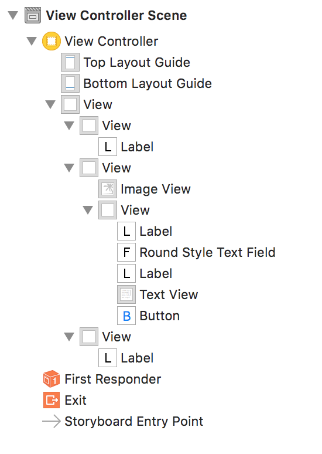
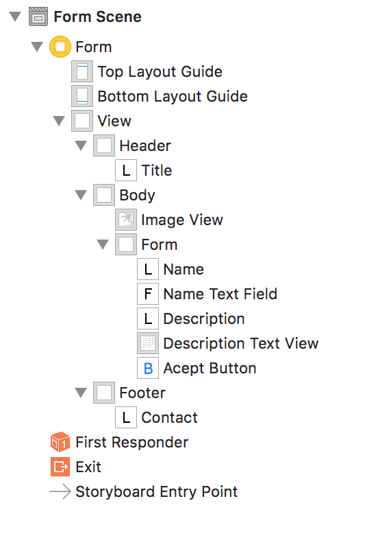

# User Interface and Visuals

## How to declare an user interface.

The two main options to define a layout are **frames with autoresizing mask** or defining **autolayouts** constraints that will generate the frame. The two options are valid depending on the context.

[**Autolayout**](https://developer.apple.com/library/content/documentation/UserExperience/Conceptual/AutolayoutPG/index.html) is the most advanced system that allows defining a flexible interface that suits all screen sizes and content. 

You can see the anatomy of a constraint in the [official documentation](https://developer.apple.com/library/content/documentation/UserExperience/Conceptual/AutolayoutPG/AnatomyofaConstraint.html#//apple_ref/doc/uid/TP40010853-CH9-SW1).

When executing constraints if they are poorly defined can lead to inconsistencies that would cause us a running error when it can not satisfy all the constraints. It is important to **test our interface on all devices or circumstances** in which it can be used.

**Prioritize your constraints** if you need it, in case of not being able to fulfill all, they are discarded those that have a lower priority. If you only need two or three levels of priority, use the UILayout constants otherwise define your own priority system:

```swift
constraint.priority = UILayoutPriorityDefaultLow
```

A very useful tool is the **hugging** and **compression resistance** properties. Defines which views should be expanded or compressed. They can be defined for the x-axis or y-axis.

- If subviews fit and need to be expanded, the *hugging* property will operate. The views with the lowest priority will expand.
- If subviews do not fit and must be compressed, the *compression resistance* property will operate. The views with the lowest priority will be compressed.

```swift
label.setContentCompressionResistancePriority(UILayoutPriorityDefaultLow, for: .horizontal)
label.setContentHuggingPriority(UILayoutPriorityDefaultHigh, for: .horizontal)
```

It is important to design the constraints thinking about the animations. If we want to animate a constraint, the only part that can be changed is the constant. In other case, we must activate or deactivate the constraint by losing the possibility to animate it.

Some visual elements have an **intrinsic size** defined so it is not mandatory to define a height and a width, we must only define their position. For example: UILabel, UIImageView, UINavigationBar... If you create a custom view and have a default size, you must overload the method *intrinsicContentSize*.

```swift
override var intrinsicContentSize: CGSize { .. }
```

**Frames with autoresizing masks** require a much lower computing cost and are convenient if the performance of autolayouts is not fast enough.

### Programmatically

Defining our interface by code we will have a greater control over the changes and will allow us to work better in large groups. It also allows us to reuse code and interfaces in a simpler way.

Only the visual elements or constraints you'll need later will be saved to a property.

Give consistent names to all the views and constraints you are going to store.

* Wrong way:

	```swift
	let view: UIView
	let label: UIlabel
	let textField: UITextField
	let button: UIButton
	```
* Right way:

	```swift
	let form: UIView
	let title: UIlabel
	let ageField: UITextField
	let sendForm: UIButton
	```

When defining your constraints keep them organized by how they are represented in the interface.

Separate magic numbers and colors to visual constants. If they are shared between several screens, they should not be copied to each interface.

If the interface is very large try to split it.

If you define a custom view remember to define an intrinsicSize if the view has a default size.

```swift
subView.translatesAutoresizingMaskIntoConstraints = false
view.addSubview(subView)

subView.widthAnchor.constraintEqualToAnchor(view.widthAnchor).active = true
subView.heightAnchor.constraintEqualToConstant(view.heightAnchor).active = true
subView.rightAnchor.constraintEqualToAnchor(view.rightAnchor).active = true
subView.leftAnchor.constraintEqualToAnchor(view.leftAnchor).active = true
```

### Using Interface Builder

Creating an interface with Interface Builder complicates group work, conflicts are more difficult to solve. On the other hand, you can make faster developments and check if everything works correctly before running it.

Combining *XIB* with *Storyboards* will allow you to reuse your interfaces.

Create multiple Storyboard, so you can work better in team and separate the logic of your interfaces by sections.

If the interface is very large try to split it.

Combining storyboards with code is a must. If you want to reuse some interfaces or make customizations you will need to create a part of the interface by code.

Use *IBDesignable* and *IBInspectable*, so you can view the interfaces made by code in Storyboard.

Name the tags in the Interface Builder:

| Wrong way | Right way |
| --- | --- |
|||

## Animations

Animations can be a tricky part of the application. It is important to think about them in advance. So you can know how it can affect the design of the layout.

Keep the animations always in the presentation layer of your application.

Keep the values of the animations separated in constants. If it's possible organize the animations by states.

```swift
UIView.animate(withDuration: animation.duration) {
    label.backgroundColor = wrongState.endColor
}
    
struct animation {
    static let duration: TimeInterval = 2.0
}
    
struct defaultState {
    static let color: UIColor = .white
}
    
struct wrongState {
    static let color: UIColor = .red
}
```

If you make animations with autolayout remember to do a *layoutIfNeeded* before running the animation.

```swift
view.layoutIfNeeded()
constraint.constant = 200
UIView.animate(withDuration: 1.0) {
    self.view.layoutIfNeeded()
}
```

If the animations are very complex an option is to execute a sequence of images. You should keep in mind that the animation should be short and control the weight of the files. Another option is an animated SVG although you may need include third-party libraries.

## Image Assets

1. Image format

	The [officially supported](https://developer.apple.com/library/content/documentation/Xcode/Reference/xcode_ref-Asset_Catalog_Format/ImageSetType.html) files are PNG, JPG and PDF. Vector PDFs require size in metadata since in compilation it will generate a PNG with all necessary resolutions. It is not a real support for vector images.
	
	SVG is not officially supported, you will need libraries like [PocketSVG](https://github.com/pocketsvg/PocketSVG).
	
	If the images have a very large weight you can use image compressors like [TinyPNG](https://tinypng.com/).

2. Image size

	By default the images for iOS are 1x, 2x and 3x. You can check it in the [official documentation](https://developer.apple.com/ios/human-interface-guidelines/graphics/image-size-and-resolution/).
	
3. Asset catalog
	
	By default all the images must be here, it gives us some useful tools explained in the [official documentation](https://developer.apple.com/library/content/documentation/Xcode/Reference/xcode_ref-Asset_Catalog_Format/).

4. App icon

	It should be included within the asset catalog. You can check the [official documentation](https://developer.apple.com/ios/human-interface-guidelines/graphics/app-icon/).
	
	Also you can use external tools that help you generate them in all sizes, for example [MakeAppIcon](https://makeappicon.com/).

5. Launch image

	If you don't have to support below iOS 8, you can use Interface Builder instead default PNG file.  You can check the [official documentation](https://developer.apple.com/ios/human-interface-guidelines/graphics/launch-screen/).
